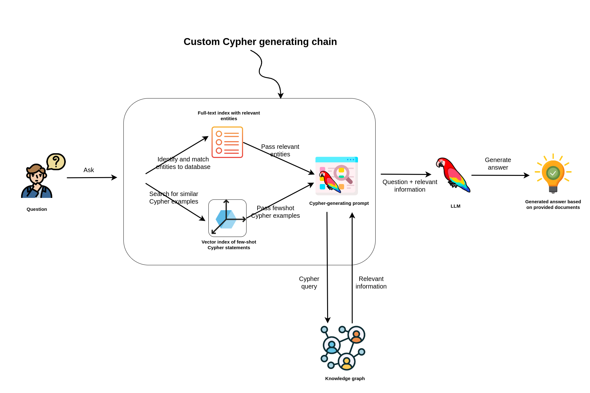

# streamlit-neo4j-hackathon

This repository has been created as an application to the [Streamlit LLM hackathon](https://streamlit.io/community/llm-hackathon-2023).

The idea is to present multiple ways of improving Cypher-generating capabilities of LLMs to improve RAG applications based on knowledge graphs like [Neo4j](https://neo4j.com/). LangChain is used for all the LLM integrations and functionalities.

Demo is available on Streamlit community cloud: https://vc-chatbot.streamlit.app/

*You need to have access to GPT-4 in order for the demo to work!*

## Dataset

There is a demo database running on demo.neo4jlabs.com. This database is a set of companies, their subsidiaries, people related to the companies and articles mentioned the companies. The database is a subset of the [Diffbot](https://www.diffbot.com/) knowledge graph. You can access it with the following credentials:

```
URI: neo4j+s://demo.neo4jlabs.com
username: companies
password: companies
database: companies
```


The database contains both structured information about organizations and people as well as news articles.
The news articles are linked to the mentioned entity, while the actual text is stored in the `Chunk` nodes alongside their _text-embedding-ada-002_ vector representations.

You can ask questions related to companies, such as their board members, suppliers, competitors, subsidiaries, and investors. Additionally, you can ask questions regarding the news about those organizations, or just search through news in general using semantic search.

## Architecture

The code include a couple of improvements to the original LangChain [GraphCypherQAChain](https://python.langchain.com/docs/use_cases/more/graph/graph_cypher_qa):

* Entity matching: an LLM extract all people or organizations from the questions and then uses Full-text search to match them to database entities
* Dynamic few-shot examples: Fewshot Cypher statement examples are imported to the database and indexed using the vector index. At query time, vector index search is used to find the most similar fewshot example, which are then used in the Cypher generating prompt
* Relationship direction validation: A module has been added that programatically validates and corrects relationship directions in LLM-generated Cypher statements based on the existing graph schema.



## Setup local environment

To setup a local database replicating the dataset used in the demo, you need to follow these steps:

* Download the [database dump](https://drive.google.com/file/d/1HY9Zkxvj3s6-KonAuF8hCrd8ZGptOy2Y/view?usp=sharing) and restore it
* Import fewshot examples and add vector/full-text indices by following the `import.cql` script. _You need to provide the openai_api_key to calculate the fewshot example embedding values_

Then you can run the streamlit application by install the requirements and setting the [streamlit secrets](https://docs.streamlit.io/streamlit-community-cloud/deploy-your-app/secrets-management) for the following variables:

* NEO4J_USERNAME
* NEO4J_PASSWORD
* NEO4J_URI

And optionally `NEO4J_DATABASE`. You can then start the streamlit application by running:

```
streamlit run src/app.py
```

## Contributions

Contributions are welcomed in the form of pull requests.